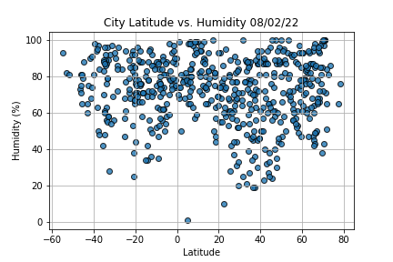
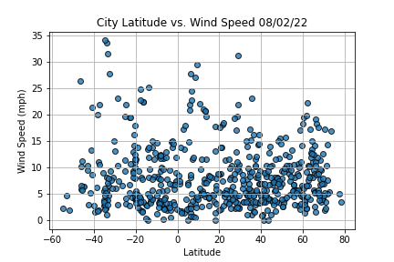

# World_Weather_Analysis
## Overview of the analysis: 
The purpose of this analysis was to use Google Maps API and weather tracking API to identify the weather of randomly generated cooridnates. After the initial analysis, the user can input a temperature range that they would like their vacation spot to have, and we futher utilize Google Maps API to discover nearby hotels for the user to stay at, as well as plan a road trip for a country they would like to visit.
## Results: 

From Figure 1 to 4 we can see we can see all the different trends of the cities that we randomly generated with random coordinates. Each figure tracks a different measurement from max temp to wind speed.

From the image of the map above, I was able to track the random cities, add a marker to them with general infomation (city name, country, max temp, closest hotel name).

From the image above, "the user" wanted a vacation spot with temperature range of 80 degrees to 90 degrees, he then selected to go on a trip to Japan and I was able to plot out the best route for him to take during his time in Japan.

The image above is to show general information + hotel name of the cities he will visitng.
